# Project Progress & Roadmap

## 📊 Progress Flow Chart

```mermaid
graph TD
    subgraph Work_Done [✅ Work Done]
        A[Project Initialization] --> B[Core Infrastructure]
        B --> C[Frontend Architecture]
        C --> D[Modules Implemented]
        D --> E[Dashboard & Wallet]
        D --> F[Planning & Analytics]
        D --> G[Financial Tools]
        D --> H[AI Integration]
        D --> I[Data Persistence]
    end

    I --> J

    subgraph Future_Plan [🚀 Future Plan]
        J[Performance Optimization] --> K[Advanced Testing]
        K --> L[Accessibility Improvements]
        L --> M[UI/UX Polish]
    end

    style Work_Done fill:#e1f5fe,stroke:#01579b,stroke-width:2px
    style Future_Plan fill:#fff3e0,stroke:#ff6f00,stroke-width:2px
```

## ✅ Work Done

### Core Features
- **Dashboard**: Real-time financial overview with AI predictions.
- **Wallet**: Transaction management with advanced filtering and categorization.
- **Planning**: Budget creation and savings goals tracking.
- **Analytics**: Visual spending trends and insights using Recharts.

### Financial Tools
- **Investment Portfolio**: Track stocks, crypto, ETFs, and bonds.
- **Tax Planner**: Optimize tax savings based on Indian tax system.
- **Credit Score Monitor**: Track credit score and get improvement tips.
- **EMI Calculator**: Calculate loan EMIs with amortization schedules.
- **Net Worth Tracker**: Monitor assets vs liabilities.
- **Debt Tracker**: Manage and pay off debts strategically.
- **Bill Reminders**: Manage recurring payments and due dates.

### AI Integration
- **Chat Interface**: Interactive chat with AI Finance Mentor.
- **OpenRouter API**: Integration with Gemini Flash model for personalized advice.

### Technical Implementation
- **Frontend**: React 18, Vite, TypeScript, Tailwind CSS.
- **State Management**: React Context API for global state.
- **Routing**: React Router DOM for seamless navigation.
- **Persistence**: LocalStorage for data retention across sessions.

## 🚀 Future Plan

### Frontend Enhancements
- **Performance Optimization**: Code splitting, lazy loading, and bundle size reduction.
- **UI/UX Polish**: Refine animations, transitions, and responsive design for all screen sizes.
- **Code Quality**: Refactor components for better reusability and maintainability.

### Quality Assurance
- **Testing**: Add comprehensive unit and integration tests (Jest/React Testing Library).
- **End-to-End Testing**: Implement Cypress or Playwright for critical user flows.

### Accessibility
- **WCAG Compliance**: Ensure the app is accessible to all users (ARIA roles, keyboard navigation, screen reader support).
- **Color Contrast**: Verify and improve color contrast ratios for better readability.
